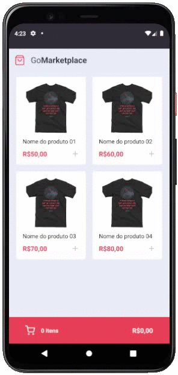

<h1 align="center">

</h1>

## 🛍️ GoMarketplace
Este repositório é referente ao desafio 'Fundamentos do React Native' do Bootcamp GoStack 11.0, da Rocketseat 🚀.

---
<p align="center">
 <a href="#-sobre">Sobre</a> |
 <a href="#-requisitos">Requisitos</a> |
 <a href="#-tecnologias">Tecnologias</a> |
 <a href="#%EF%B8%8F-como-executar">Como executar</a> |
 <a href="#-executando-os-testes">Executando os testes</a> |
 <a href="#-licença">Licença</a> |
</p>

<h1 align="center">
  
</h1>

## 🚀 Sobre
Este é um projeto desenvolvido é uma loja física para estudos de contexto do React-Native possuindo como estudo principal o Context API e seu hook. A ideia é apens simular a parte front-end de um e-commerce interagindo com os dados de uma fake API.

## 📚 Requisitos
- Ter [**Git**](https://git-scm.com/) para clonar o projeto.
- Ter [**Node.js**](https://nodejs.org/en/) instalado.
- Ter [**Docker**](https://www.docker.com/) rodando um container PostgreSQL ou o [**PostgreSQL**](https://www.postgresql.org/) instalado em sua máquina e configurado.

## 🚀 Tecnologias
- [TypeScript](https://github.com/microsoft/TypeScript)
- [ReactJS](https://github.com/facebook/react)
- [React-Native](https://reactnative.dev/)
- [styled-components](https://github.com/styled-components/styled-components)
- [React-Icons](https://github.com/oblador/react-native-vector-icons)
- [axios](https://github.com/axios/axios)
- [ESLint](https://github.com/eslint/eslint)
- [Prettier](https://github.com/prettier/prettier)

## ⚙️ Como executar

```bash

    # Clonar o repositório
    $ git clone https://github.com/claudianopl/GoFinances.git

    # Navegar para o diretório
    $ cd GoMarketplace

    # Instalar as dependências
    $ yarn

    # Inicializando a fake API
    $ json-server server.json -p 3333

    # Em outro terminal se estiver executando android
    $ yarn android

    # Em outro terminal se estiver executando IOS
    $ yarn ios

    # Executar testes
    $ yarn test
```

## 📖 Executando os testes


## 📝 Licença
Esse projeto está sob a licença MIT. Veja o arquivo [LICENSE](LICENSE.md) para mais detalhes.

---
Feito com 💜 by Claudiano Lima

<p align="right">
  
  &nbsp;&nbsp;&nbsp;&nbsp;&nbsp;&nbsp;
  
</p>
